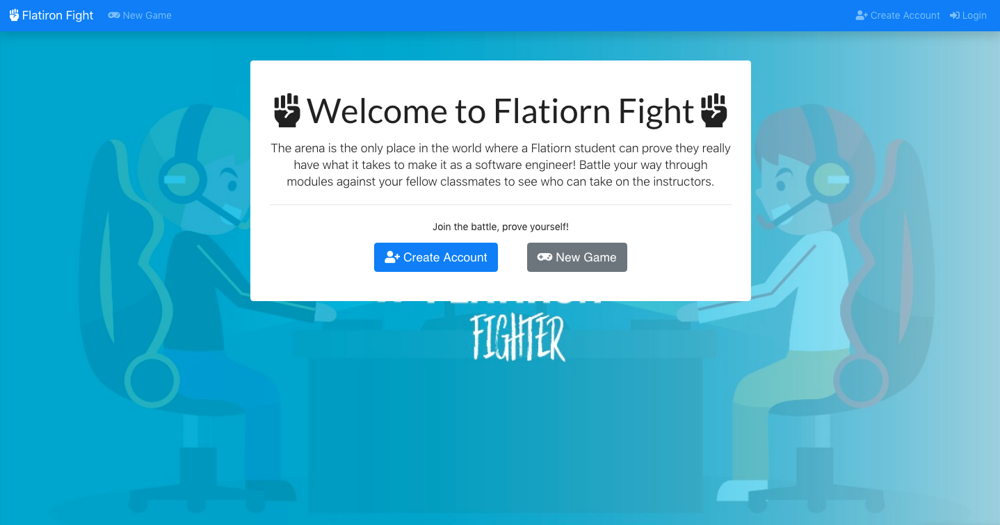
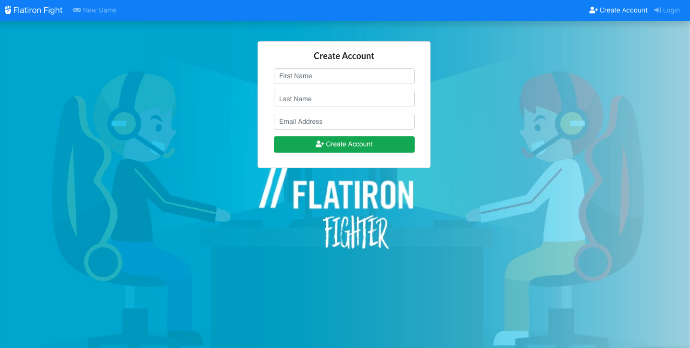
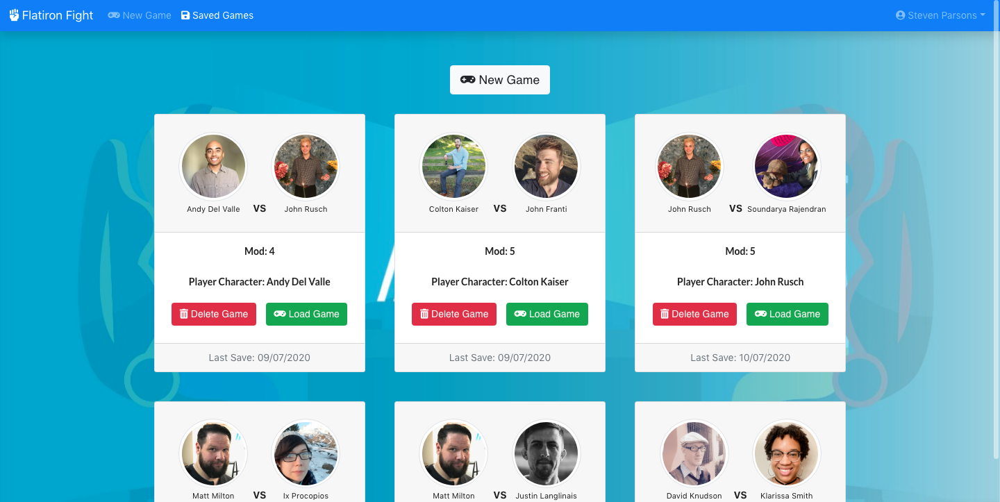
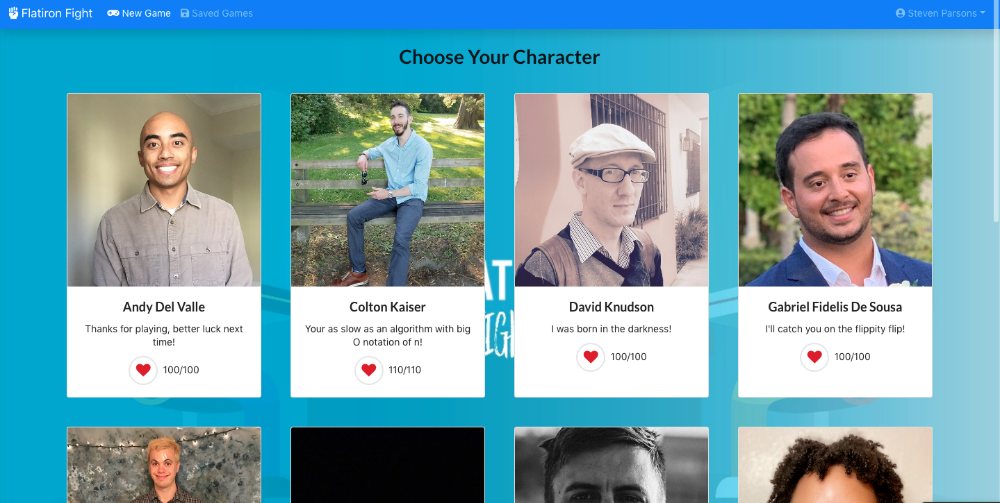
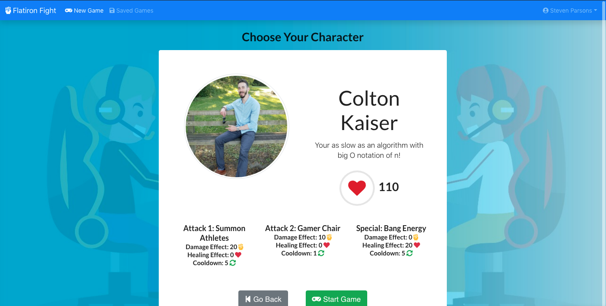
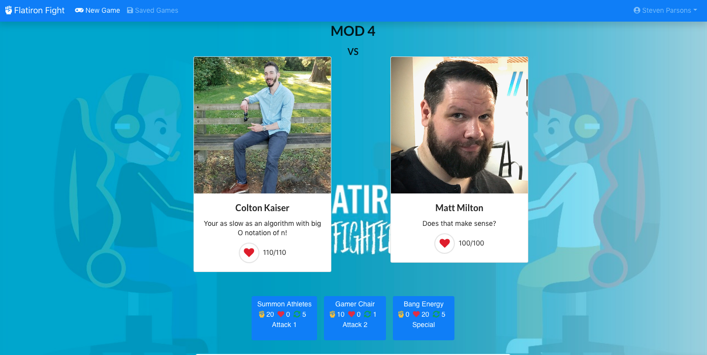
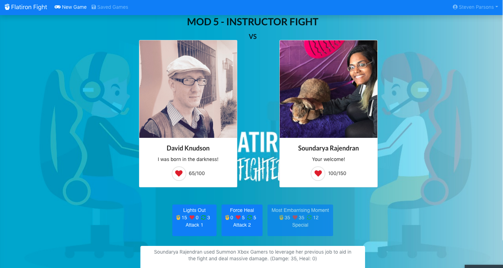
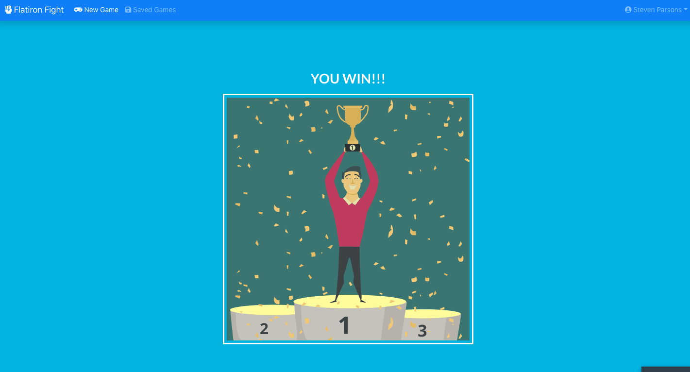

# Flatiron Fight - Frontend

Flatiron Fight is a game made with React that highlights the members of the Flatiron 4/20/2020 cohort and their amusing personalities. A user can select a character inspired by a cohort member, and use custom abilities to fight through the 'Flatiron Mods' in order to reach 'Mod 5' and face off against a Flatiron instructor.

[This](https://github.com/mathewpwheatley/module-4-project-fantasy-rpg-backend) is a link to the back-end repository.

## Motivation

We wanted to create a game that memorialized our cohort and the fun things we learned about eachother along the way.

## Screenshots
Home Page

Create Account

Load Saved Game

New Game - Choose Character

View Character Specs Before Choosing

Level 4

Level 5 - Boss Fight

Beat The Game

## Technology Used

- JS
- Rails Router
- React
- Bootstrap
- React Animations

## Features

Users Can:
- Create an account
- Start a new game
- Choose a character
- Automatically have their game saved, and have access to reloading that saved game
- Fight against other characters for 4 leves, and against a bos at the 5th level, and beat the game
- Rematch if they lose a battle

## Installation

Flatiron fight is hosted on Heroku therefore you can access it directly from your browser
- https://flatiron-fight.herokuapp.com

If you want to install locally, follow the below steps:
- Clone the front-end, and run 'npm i && npm audit fix' then 'npm start'

## Contributing

Contributions are welcome, submit a pull request!

## Authors

* **Steven Parsons** - [GitHub](https://github.com/sap24471)
* **Mathew Wheatley** - [GitHub](https://github.com/mathewpwheatley)
* **Gabriel de Sousa** - [GitHub](https://github.com/GabedeSousa)

## License

This project is licensed under the [GNU GPL](https://www.gnu.org/licenses/gpl-3.0.en.html)
